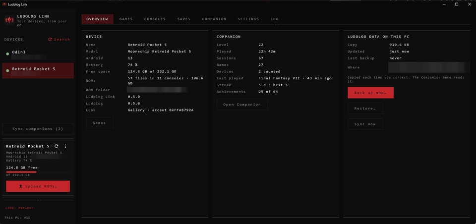
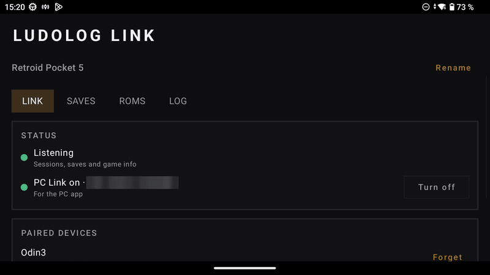

# Ludolog Link

**v0.5.0** · The companion of [Ludolog](https://github.com/monkikolab/ludolog-front-end). It keeps
your handhelds in sync with each other and with your PC, over your own Wi-Fi.

## Features

### On your handhelds

- **Your saves, everywhere.** After you play, your saves go to your other devices. Before you
  play, Ludolog checks that there isn't a newer one elsewhere. Dated backups let you go back.
- **One Companion.** Sessions from all your devices add up to the same character in Ludolog.
- **ROMs between devices.** Copy games from one handheld to another, with their box art and video.
- **Same game, same name.** A name, description or genre you fix on one device shows up on the
  others.

### On your PC (Windows)

- Every game on every device, side by side: copy, download and rename them, and fix or fetch their
  box art and videos.
- Backups of your saves and of Ludolog's data, ready to restore, and Ludolog's settings for each
  device.
- The Companion with its statistics, and a log of what happened.

### Private

Devices find each other on your local network and pair with a code. Your saves, sessions and games
never go through the internet. The only things that do are cover and video searches on the PC, when
you ask for them, and a daily check for a new version, which you can turn off. Link is meant for
your own Wi-Fi: its traffic isn't encrypted, so on a shared network (a hotel, an event) turn off
Sharing and PC Link.

## Install

1. **On each handheld:** install [Ludolog](https://github.com/monkikolab/ludolog-front-end) first,
   then the Ludolog Link APK from the
   [latest release](https://github.com/monkikolab/ludolog-link/releases/latest). Both must come
   from their official releases, so they can talk to each other.
2. **On the PC (Windows),** from the same release, whichever you prefer:
   - **Installer** (`.msi`): installs for your user, with no administrator rights, and adds Start
     menu and desktop shortcuts. A newer one replaces the old; uninstall it from Windows settings.
   - **Portable** (`-portable.zip`): unzip it in a folder you can write to and run
     `Ludolog Link.exe`. Nothing is installed; delete the folder to remove it.

   Both keep their settings in your Windows user folder, so you can switch from one to the other.
   If Windows says *Windows protected your PC*, choose *More info* → *Run anyway*. The first launch
   takes a little longer.

Then open Link on a handheld and follow its setup. The [user guide](docs/manual.md) covers the rest.

## Still in testing

So far Ludolog Link has been tried with an AYN Odin 3 (Android 15), a Retroid Pocket 5 (Android 13)
and a Windows PC. Saves are shared for RetroArch, AetherSX2 / NetherSX2, Dolphin, PrimeHack,
PPSSPP, Azahar and Eden, but not for DuckStation or ARMSX3 on Android 15: see the
[known limitations](docs/limitations.md). Expect rough edges, and please
[report what you find](https://github.com/monkikolab/ludolog-link/issues).

## Support the project

Ludolog and Ludolog Link are free, made in spare time. If you'd like to help them keep growing
(more themes, more emulators, more devices tested), you can buy me a coffee on
**[Ko-fi](https://ko-fi.com/monkikolab)**. Bug reports and feedback help just as much.

## AI assistance disclosure

AI assistance was used while building this project. I reviewed the code throughout development and
understand how the app works and what it does.

## License

[GPL-3.0](https://www.gnu.org/licenses/gpl-3.0.html). See also [NOTICE](NOTICE.md).
For developers: [building from source](docs/building.md).
