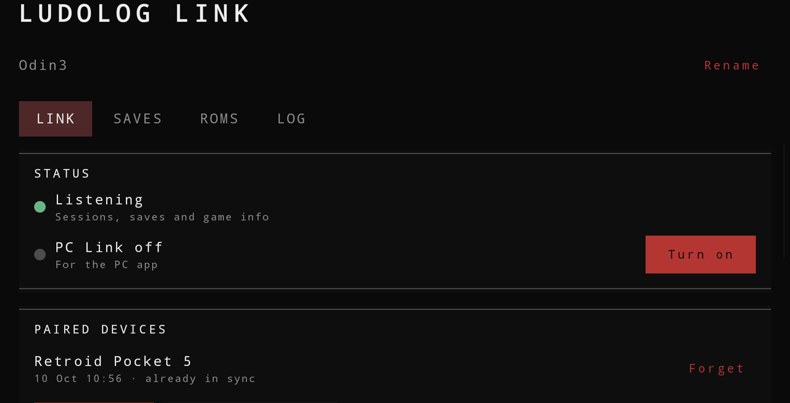
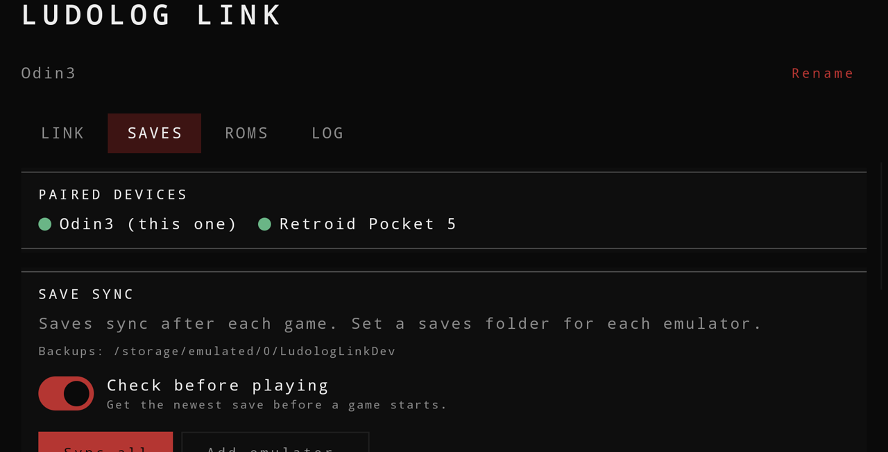
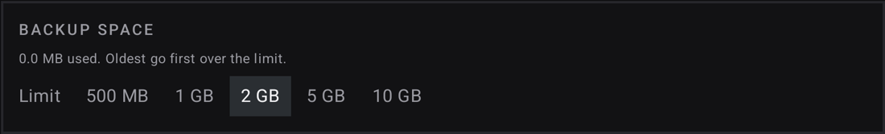

<h1 align="center">Ludolog Link</h1>

<b>Your saves, games and play time, across your handhelds and your PC.</b>

  
  
  
  
  

  <a href="https://github.com/monkikolab/ludolog-link/releases/latest">Download</a> ·
  <a href="#quick-start">Quick start</a> ·
  <a href="docs/manual.md">User guide</a> ·
  <a href="https://github.com/monkikolab/ludolog-front-end">Ludolog</a> ·
  <a href="https://github.com/monkikolab/ludolog-link/issues">Report a bug</a>

An add-on for [Ludolog](https://github.com/monkikolab/ludolog-front-end). Play on one handheld
and pick up on another with the same save; send games from one handheld to another; keep one
Companion with every session you play, wherever you play it; and, if you like, manage it all from
your PC. All over your own Wi-Fi.

> [!NOTE]
> No cables, no accounts, no cloud. No root, no Shizuku, and no USB debugging or developer options:
> Link talks to your other devices over your local network, like any app. You pair each device once,
> with a 6-digit code, and they find each other from then on.

> [!IMPORTANT]
> For Link to work, your handhelds and your PC must be on the same Wi-Fi network. Use a private
> network you trust, like your home Wi-Fi: what travels between your devices isn't encrypted.

## Why Link

### Between your handhelds, no PC needed

  
  

- **Your saves, everywhere** *(experimental)*. After you play, your saves go to your other
  handhelds over Wi-Fi.
- **A warning before an old save.** Before a game starts, Ludolog brings its newest save from your
  other devices. If it can't (the other handheld is off, or both changed), it tells you before you
  play, so you don't continue from an older save by mistake.
- **Safe by design.** Saves are backed up hourly, daily or weekly, as you choose, and always before
  anything replaces them. Once the backups reach the space limit you set, the oldest go first, so
  they never fill your storage. A conflict is never resolved behind your back: you pick the version
  to keep.
- **Games over Wi-Fi.** Send ROMs from one handheld to another, with their box art and video.
- **One Companion, shared on its own.** Your sessions on every handheld reach the others by
  themselves, so each one shows the same character, the same hours and the same achievements.
- **Same game, same name.** A name, description or genre you fix on one device shows up on the
  others.

> [!WARNING]
> Save sync is experimental. It has been tested with in-game saves (the ones a game writes to its
> memory card or cartridge), not with save states. It also needs a little setup: on each handheld,
> point Link to the saves folder of each emulator you use, and use the same emulators on every
> handheld. Keep the backups on until you trust it with your games.

<b>Save sync on a handheld</b>

 

### On your PC (Windows), if you want it

The PC app is optional: saves, games and sessions already travel between handhelds without it. With
it, you also get:

- **Every game on every device, side by side**, plus a catalog kept on the PC. Filter by console,
  device, missing files or art, and conflicts. Copy, download, rename and delete them, or drop files
  on the window to send them to a device.
- **Box art and videos**: preview, fix or fetch them for any game, on every device at once.
- **Backups on the PC, ready to restore**: your saves, and all of Ludolog's data (settings,
  logbooks, edits), with a full backup that also keeps art, videos, the catalog and themes.
- **Each device's settings**, edited with a keyboard and mouse and sent back to it.
- **The Companion on a big screen**, with its statistics, and a log of what happened.
- **Installer or portable**: the portable copy keeps everything in a folder next to it, so it fits
  on a USB stick.

### Private by design

Devices find each other on your local network. Your saves, sessions and games never go through the
internet. The only things that do are cover and video searches on the PC, when you ask for them, and
a daily check for a new version, which you can turn off. Because the traffic between your devices
isn't encrypted, Link is meant for your own Wi-Fi: on a shared network (a hotel, an event, a café),
turn off Sharing and PC Link.

## Install

**On each handheld**, after [Ludolog](https://github.com/monkikolab/ludolog-front-end):

Or download `ludolog-link-<version>.apk` from the
[latest release](https://github.com/monkikolab/ludolog-link/releases/latest). Ludolog can also install
it for you from its welcome screen. Ludolog and Link must both come from their official releases,
so they can talk to each other.

**On the PC (Windows)**, optional, from the same release, whichever you prefer:

- **Installer** (`.msi`): installs for your user, with no administrator rights, and adds Start menu
  and desktop shortcuts. A newer one replaces the old; uninstall it from Windows settings.
- **Portable** (`-portable.zip`): unzip it in a folder you can write to and run `Ludolog Link.exe`.
  Nothing is installed: it keeps its settings, backups and downloaded games in a `data` folder next
  to it, and deleting the folder removes it.

If Windows says *Windows protected your PC*, choose *More info* → *Run anyway*. The first launch
takes a little longer.

## Quick start

1. **Install Ludolog on each handheld** and open it once. Then install Link.
2. **Open Link and follow its setup**: allow *Files* and *Notifications*, give the device a name, and
   choose where incoming games go.
3. **Pair your handhelds, once.** Same Wi-Fi, Link open on both. On one, tap *Pair a device…*, pick
   the other and enter the 6-digit code it shows. From then on they find each other.
4. **Set up save sync on each handheld.** In the *Saves* tab, *Add emulator…* and *Set folder…* for
   every emulator you use, pointing to the folder where that emulator keeps its saves. Leave *Check
   before playing* on.
5. **Play.** When you finish a game, its saves and your session go to your other handhelds. One that
   was away catches up when you come back to Ludolog. To send games, use the *ROMs* tab.
6. **Add the PC, if you like.** On the handheld, turn on *PC Link*. On the PC, click *Search*, pick
   the device and enter the code it shows. Once per device.

> [!TIP]
> Some handhelds close apps when the screen turns off. Set Link's battery use to *Unrestricted* and
> add it to the device's cleaner exceptions, so it keeps listening while you're away. Link checks
> this and warns you. The [user guide](docs/manual.md) has the details.

## Still in testing

So far Ludolog Link has been tried with an AYN Odin 3 (Android 15), a Retroid Pocket 5 (Android 13)
and a Windows PC. Saves are shared for RetroArch, AetherSX2 / NetherSX2, Dolphin, PrimeHack,
PPSSPP, Azahar and Eden, but not for DuckStation or ARMSX3 on Android 15: see the
[known limitations](docs/limitations.md). Expect rough edges, and please
[report what you find](https://github.com/monkikolab/ludolog-link/issues).

## Support the project

Ludolog and Ludolog Link are free, made in spare time. If you'd like to help them keep growing
(more themes, more emulators, more devices tested), you can buy me a coffee on
**[Ko-fi](https://ko-fi.com/monkikolab)**. Bug reports and feedback help just as much.

## AI assistance disclosure

AI assistance was used while building this project. I reviewed the code throughout development and
understand how the app works and what it does.

## License

[GPL-3.0](https://www.gnu.org/licenses/gpl-3.0.html). See also [NOTICE](NOTICE.md).
For developers: [building from source](docs/building.md).
